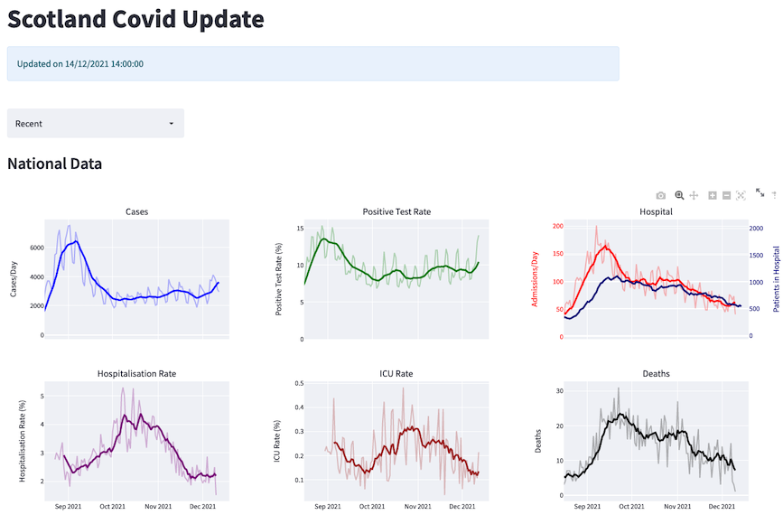

## Scotvid

[Streamlit](https://streamlit.io/) based visualisations of the latest Scotland COVID-19 Data.

A demo interface is available [here](https://share.streamlit.io/nowaycomputer/scotvid/main/Scotvid.py)

- Data is updated each weekday at 2pm. 
- Latest merged [national data](https://github.com/nowaycomputer/scotvid/blob/main/data/merged_data.csv) and [local data](https://github.com/nowaycomputer/scotvid/blob/main/data/df_city.csv) as .csv
- All test/case data is by sample date
- Hospitalisation and ICU rates are rough estimates calculated using the ratio of hospital and ICU admissions 7 and 14 days respectively after the cases by sample date
- Not all data is synchronised to the same date and the most recent day isn't generally shown because it is always significantly incomplete
- All data is sourced from the [PHS OpenData Service](https://www.opendata.nhs.scot/dataset/covid-19-in-scotland) and [Gov.uk](https://coronavirus.data.gov.uk/)
